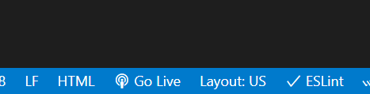

<link rel="stylesheet" type="text/css" href="../assets/css/content.css">
<h1 class="custom-header">Assignment(s) Guide</h1>

__Note:__ _This is a reference reading in support of the labs you will encounter throughout this course. It consists of helpful information you may require while working with different labs and you can use it as a point of reference._

The labs in this course have everything installed and set up so you can start working with Django right away.  You can get started with the terminal in VS Code.

## Open the terminal


## Changing project directories from the command line
Verify that you are in a directory such as /home/coder/project/workplace/myproject before running the command. Here is how you can navigate to it once the lab is up:

* For a directory named workplace, move inside the directory with the following shell command:

`cd workplace`

Move the directory up or move outside the directory by one level, by using the following command:

`cd ..`

In most cases, you will first step into the workplace directory and then again inside the project directory that contains the script for manage.py to run Django commands.  

## Setting up the virtual environment

Virtual environments are an important component of building Django projects. While their use is not required, it is considered to be a recommended practice. Before you begin with lab instructions, you need to first set up the virtual environment for the project. While there are multiple options for virtual environments available, __Pipenv__ is the recommended virtual environment for this course. 

Verify that you are in the __/home/coder/project/[YOUR_DJANGO_PROJECT]__ directory. Here is the command to navigate to it once the lab is up:
```
cd /home/coder/project/YOUR_DJANGO_PROJECT
```

Run the commands below to install and activate the virtual environment:
```
if [ -d "$HOME/.local/bin" ] ; then
    PATH="$HOME/.local/bin:$PATH"
fi

pipenv shell
pipenv install 
```

After running __pipenv shell__, a file called __Pipfile__ is created containing the list of project dependencies. The `pipenv install` command installs these dependencies for the project. 


## Commands to perform the migrations

Run the commands below in the terminal to perform migrations 

__Note__: _Verify you are in the directory where the __manage.py__ file resides._

```
python3 manage.py makemigrations # To compile the migrations
python3 manage.py migrate  # To migrate the changes in Database
```

## To view your code and instructions side-by-side, select the following in your VS Code toolbar
 
* View -> Editor Layout -> Two Columns
* To view a file in Preview mode, right-click on the file and Open Preview (in the explorer sidebar)
* Select your code file in the code tree, which will open it up in a new VS Code tab
* You can drag any file over to the second column to view the contents in that column
* Great work! You can now see instructions and code at the same time.

The labs for this course have everything installed and set up, so you can start working with APIs immediately.  You can get started with the terminal in VS Code.

## View your app in the browser

To view your app in the browser, run the server by executing the following command in the terminal.

__Note__: _Verify you are in the directory where the __manage.py__ file resides._
```
python3 manage.py runserver # To run the server
```
To view your app in the browser, open the URL generated by the __runserver__ command above, namely __http://127.0.0.1:8000__ by pressing the __Cmd/Ctrl__ key on the keyboard and clicking on the link in your Terminal as below:


## General Notes

* You may come across some code that is not directly relevant to the lab. A line such as:

```
from django.shortcuts import render
```

Here, for example, render()  is a helper function that is often required to render the template, hence Django imports it automatically. You may encounter similar auto-imports and it is safe to keep or remove them while updating the lab. 

* It's recommended that you type the code manually as you work through the exercises instead of copying and pasting. Typing the code will help you develop muscle memory and help better your understanding of the fundamental concepts of this course.

* The lab will use the Python commands that work on a Linux shell. So to run any Python command, it is advisable to use python3 as the keyword for invoking Python 3+ versions instead of just using the keyword python.

* The commands added in the Labs, readings and videos are specific to the operating system. For example, the use of Control instead of Command key in case of Windows OS and keyword python3 instead of python in case of MacOS. You should make the necessary adjustments depending on the operating system you use.  

* While all the labs work on an independent shell, on completion, it is a good practice to stop the server by pressing the following command on the shell:  Ctrl/Cmd + C.

## Working with CSS Labs in the course

To view the rendered HTML on a web page follow the step-by-step instructions below.

__Step 1:__ Save the file.

__Step 2:__ Click on 'Go live' at the bottom right of your editor.  




__Step 3:__ Click on browser preview.


__Step 4__: Enter the url as http://localhost:5500 


__Step 5__: Check that the web page displays.

After completing your lab, don't forget to close the server. You can close the server by clicking on the exposed Port number (e.g. 5500) after completing the lab.


You should see a notification like this which confirms the server has been stopped.  


