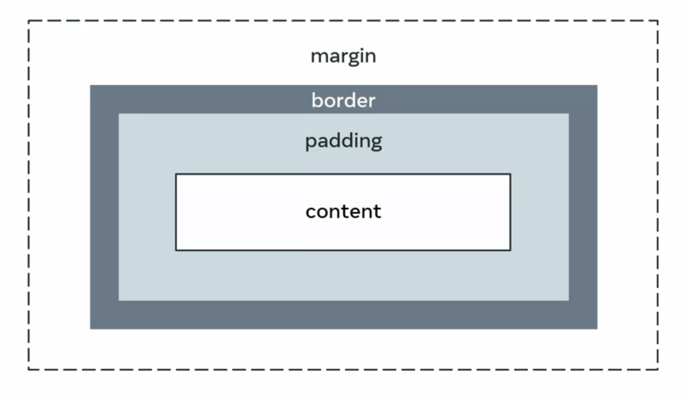

<link rel="stylesheet" type="text/css" href="../assets/css/content.css">
<h1 class="custom-header">CSS</h1>

# Introduction

* Cascading Style Sheets or <i>CSS</i>, as it is most commonly referred to, is a set of rules that enhance the appearance of web pages.
* Allows better visual design and more creativity.
* Layouts is one of the most important components of designing a web page, since layouts help divide a page into different sections, thus making the page more presentable.

# CSS Web Layouts

* CSS can be used to enhance a web page by modifying <b>fonts, colors, layouts, size</b> and other style formatting options that make the web page more presentable.
* The browser window that is visible to the user is called the <b>viewport</b>.
* The idea behind any CSS web layout is to create an optimally designed web page that has a good view port at any given point. In other words, CSS layouts are all about having the content of your webpages organized.
* When it comes to creating layouts using CSS, an important property is the <b>display</b> property.

## Display property

* The display property specifies the type of box one would want to use for a given HTML element.

|  |
|:--:|
| <i>Display property's boxes</i> | 

* The following class's display property would convert the displayed box to a block type.
```
#sample{
	display: block;
}
```
* There are two more types of boxes: <i>flexbox</i> and <i>grid</i>.

## Flexbox

* It was introduced before the grid layout
* Short for flexible box
* Adds responsiveness to CSS with float elements and positioning.
* Flexbox container applied over an element can help the elment flex to shrink or expand.

## Grid

* Similar to flexbox, except it creates a two dimensional grid along both the row and column axes