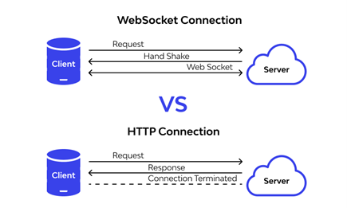

<link rel="stylesheet" type="text/css" href="../../../../SupportingFiles/content.css">
<h1 class="custom-header">Notes</h1>

# What is Full Stack Development?

## What is a Stack?

* They are a set of applications or technologies you use to fix a problem or create a project with a certain development focus. 
* Some Examples of stacks are:
    * __Front-End Stack__: Comprises of languages such as HTML, CSS, JavaScript. They are used together the front-end or the user interface part of a web application.
    * __Back-End Stack__: Comprises of languages such as python, frameworks such as Django and tools such as DRF.
    * __Data Stack__: A part of the back end stack, which consists of database management systems and database applications to process data.
* There are various types of stacks which comprise of different technologies/tools such as the MERN stack, LAMP stack, LEMP stack, etc.

## Back-End Stack:

* Has all the tools and technologies to create an applications core, which includes business logic, workflows and data. 
* Backend development uses languages such as Python or JavaScript, frameworks such as Django and utilities such as DRF.
* The back-end stack also builds tools, databases and caching applications.

## Front-End Stack:

* The front-End Stack has two distinct parts:
    * Web
    * Mobile
* Includes everything one would need to create a user interface of a web or mobile application that communicates with the backend. 

### Web Front-End Stack:

* To build the front end component, one should konw HTML, CSS, CSS frameworks.
* They should also figure out client side programming languages such as JavaScript, TypeScript and JS frameworks such as React.

### Mobile Front-End Stack:

* Either Android or iOS Development.

## Data Stack

* One of the most important part of any web application is the data stack or, the tools one uses to store, retrieve and process data.
* Contains SQL or NoSQL database engines, caching tools and everything required to process data. 
* MySQL, MariaDB, PostgreSQL are the most widely used database tools for the data stack. These would come under SQL database engines. 
* Some examples of NoSQL database engines are MongoDB and Firebase.
* For caching, Redis is a popular and a widely used solution.

## Full Stack

* It contains everything that allows one to:
    * Prepare the application's back-end
    * Process, retrieve and store data
    * Present that data via APIs
    * On web/mobile applications.
* A full stack developer is equally skilled in all of the different stacks. 
* Such a developer should also know some basic DevOps skills in order to deploy their web-app to Production, Staging and Development Servers.
* Should also be familiar with a version control solution, e.g. Git.

## Full Stack Developer's Responsibilities:

* A Full stack developer performs:
    * Understand the complete project and take full ownership
    * Select appropriate tools for developing the front-end back-end and database
    * Create effective user interfaces for the web or mobile environments
    * Develop APIs
    * Develop the back-end of applications
    * Store, process, retrieve data from databases
    * Create servers and manage them for development, staging and production access
    * Integrate with CI/CD workflows
    * Ensure responsiveness of applications
    * Work together with the graphics team to bring their ideas to life
    * Optimize the applications for maximum performance
    * Ensure that their application follows the best security practices
    
# N-Tier Architecture

* There is a difference between layers and tiers
* When all the different components of an application, the presentation component, the application's core component and the database component are present in different places of the an application's infrastructure, like on different servers but they still communicate to function correctly, then they are called tiers
* Layers are virtual separations of different parts of an application. 
* Tiers are also differnt parts of an application, but they are physically separated in the application infrastructure.
* In modern application development there can be any number of tiers.
* We are going to discuss:
    * 3-Tier architecture
    * 4-Tier architecture

## 3-Tier Architecture

* Is the most commonly used N-tier architecture.
* If your application's core component and data component are hosted on two different servers, then they form the two tiers out of the 3-tier architecture. 
* The third tier is the client machine(either web or mobile), where all the data is being presented.
* Together, the client machine, the application server and the database server make up a 3-tier architecture. 
* The three tiers are known as:
    * Presentation Tier
        * Also called thin clients. 
        * They don't contain business logic and only communicate with the application and present the data
    * Application Tier
        * The tier which contains the application's core or business logic is the application tier
    * Data Tier
        * The tier that deals with data is the data tier.

## 4-Tier Architecture
 
* In a web-application with a 4-tier architecture, the 4th tier is known as the delivery tier.
* This delivery tier deals with caching and delivering front-end assets to the client. E.g:
    * __Content Delivery Networks(CDN):__ They have multiple servers all across the world and help deliver a web applications HTML, CSS, JavaScript code and images to a client from the nearest physically located server.
* Since they delivery tier is physicaly separated from all the other tiers, its considered as a different tier.
* This is just an example of a  4-tier web application.
* They can be very different depending on the web applications purpose. 

## Benefits of N-tier architecture:

* Security
* Scalabiity
* Maintenance
* Improvement
* Thus application development process becomes more efficient using N-tier architecture.

# Client-Server Architecture

## Introduction

Full stack development includes both a back-end and front-end stack. The back-end, or the core of a web application or an API project, is hosted on a server or serverless platform. In turn, the web application or API is used by clients. So there are two distinct parts: a client and a server, and together they form the client-server architecture.  

## The client-server architecture 

Every website you browse, the multiplayer mobile games you play and modern home appliances connected to the internet – all of these are applications running on a client-server architecture.  

First is the client which is the computer or mobile device used to communicate with the back-end application. When the client devices only communicate with the back-end and just display or present the data and don’t apply the business logic, these devices are called thin clients.  If client devices consume data from the API and do heavier data processing on the client side, they are called thick clients. 

Second is the server. In a client-server architecture, the server hosts the application's core that deals with incoming data, applies business logic and saves and processes data in a database. The application's core is hosted on cloud computing units, on virtual machines, containers, or a dedicated server. Using an N-tier architecture, the application can have different layers spread across multiple physical or virtual servers. 

## How it works 

In a client-server architecture, computers are connected via a network which can be either public or private. The client or the front-end application accepts the user data, does some basic validation, and sends the data to the server.  

The server accepts the incoming data and runs through rigorous validation and sanitization processes to ensure the information is valid and doesn't contain any potentially malicious content. Validation and sanitization are essential parts of every client-server architecture. The rule of thumb is: don't trust anyone. As the application developer, you must validate and sanitize data no matter how trusted the source of the data is.  

The data is then processed by business logic, saved or served from the database, and a response is sent back to the client. Then the client processes the server response data, makes decisions, or simply displays it to the visitor.  

In a client-server architecture, the server should be capable of simultaneously handling multiple requests from multiple clients. If the server capacity is insufficient and can’t accept the number of incoming requests then it has to be scaled. You can adjust the server capacity using different scaling techniques you will learn about later in this course.  

And, when it comes to communication, you should follow standard communication protocols like HTTP or Websocket to establish communication between the client and the server. 

A diagram that demonstrates the difference between a WebSocket and HTTP Connection

## Advantages 
One of the most significant benefits of using client-server architecture is the separation of the different layers of your application. The database can be installed and managed in a totally separate layer, and the data stays synced in a centralized location. In this way it allows multiple clients to communicate and use that information at the same time.  

Think about the Little Lemon application you have been working on throughout the courses in this program. Without client-server architecture, it wouldn’t be possible to host the restaurant data in a separate server and process it so that whenever something changes, every client sees the fresh and updated data.  

Since different application parts are stored in different layers or tiers, scaling, optimizing, and securing the infrastructure and data becomes easier. Backing up and recovering data in case of accidental loss or hardware failure is also easier because you can directly deal with that tier or layer instead of potentially causing problems in the whole application. 

Additionally, client-server architecture is cost-effective because you can host it on the cloud with an on-demand pricing model and pay only for what you use. You don't need to purchase expensive physical computers to host your application. You also don't need powerful clients to run the business logic. Everything is done on the server, and then the final output is served to the client, which they can display directly or after some minimal processing if required.  

## Disadvantages 
Like every architectural pattern, the client-server computing model also has some disadvantages. The first is management: you have to spend time configuring, managing, and maintaining the servers to keep them in working order. Also, unmonitored or abusive usage of the API provided by your application can cause a spike in monthly bills. Furthermore, security can be a big concern. When a security breach occurs, sensitive user data can leak, and severe financial damage can follow. And, if the server goes down or becomes unresponsive for any reason, the client applications will also stop working.  

## Conclusion 
This reading taught you about the very popular client-server architecture you can use in every full stack application or API project. You also learned about the advantages and disadvantages of client-server architecture.  

# Additional Resources

* [These](./Additional-Resources.md) resources can be helpful throughout the course.

# HTML

* [This document](./HTML.md) can be used to learn more about HTML.